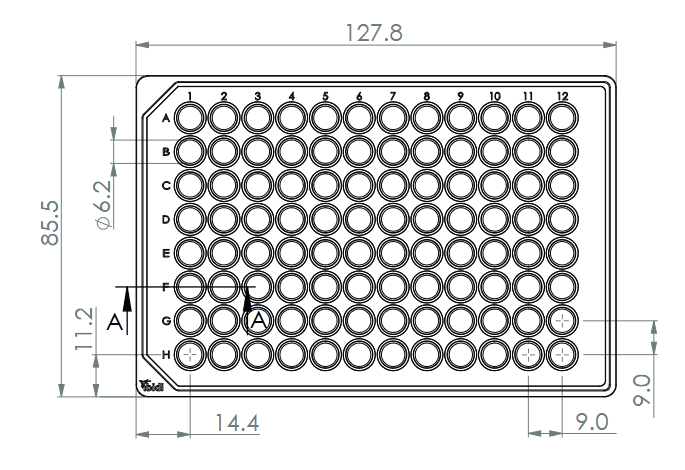
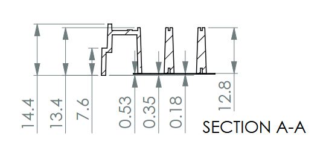

Usage
=====

.. _installation:

Installation
------------

This module is still in early development, so please install directly from the main branch using pip with the following command:

.. code-block:: console

   $ pip install git+https://github.com/JamesWGrimshaw/AgarosePlateStamper.git

.. _Initialising your plate:

Initialising your plate
------------------------

To initialise your plate, you will need to create a new instance of the :class:`multiwell_plate` class giving the 
basic dimensions of the plate which can be found in technical drawings provided by the manufactuer. 
For example here are the technical drawings for the ibidi µ-Plate 96 Well Round:

From the top down view we can see that the plate is 127.8 mm length and 85.5 mm width, has a well diameter 
of 6.2 mm and a well spacing of 9 mm. We can also get the X and Y offsets of the wells from the edges of 
the plate at 14.4 mm for the X offset and 11.2 mm for the Y offset. We can also get the rows and columns 
of the plate which are 8 and 12 respectively.

From the side on view we can see that each well is 13.4 mm deep (excluding the lip around the edge of the plate).

Therefore with this information we can initialise our plate as following:

.. code-block:: python

   from AgarosePlateStamper.generator import multiwell_plate

   plate = multiwell_plate(127.8, # PlateLength
						   85.5, # PlateWidth
						   6.2, # WellDiameter
						   9, # WellToWellDistance
						   13.4, # WellDepth
						   14.4, # WellXOffset
						   11.2, # WellYOffset
						   8, # Rows
						   12 # Columns
						  )

These are the essential components of the plate for initialisation, however there are other optional parameters that can be set.
In order to export the generated models you will need to have OpenSCAD installed on your system and the path to the OpenSCAD executable
set in the `OpenSCADPath` parameter. To install OpenSCAD please visit the following link: https://openscad.org/downloads.html

You may also want to increase the number of segments used to generate the well geometry, this can be done by setting the `CylinderSegments` parameter.
If we have both of these set we can initialise our plate as follows:

.. code-block:: python

   plate = multiwell_plate(127.8, # PlateLength
						   85.5, # PlateWidth
						   6.2, # WellDiameter
						   9, # WellToWellDistance
						   13.4, # WellDepth
						   14.4, # WellXOffset
						   11.2, # WellYOffset
						   8, # Rows
						   12, # Columns
						   OpenSCADPath="C:/Program Files/OpenSCAD/OpenSCAD.exe", # Path to OpenSCAD executable
						   CylinderSegments=256 # Number of segments to use for the well geometry
						  )

There are many additional parameters that can be set allowing you to tune the print to your specific needs. For a full list of parameters please see the `multiwell_plate` class documentation.

.. _Exporting your models:
Exporting your models
---------------------

Once you have initialised your plate you can generate the models and export them using the `export_object` method.
You can export the models in either the scad format or stl format. When exporting in the stl format it will likely 
take longer to export the models, especially if you have a high number of `CylinderSegments` set. It is often worth
setting a lower number of `CylinderSegments` when prototyping and then increasing the number when you are ready 
to export the final models.

For example, to export both the stamp and the mould you can use the following code:

.. code-block:: python

   plate.PlateStamp.export_object("Stamp.stl", stl=True)
   plate.PlateMould.export_object("Mould.stl", stl=True)

You may also want to quickly visualise the models while prototyping, this can be done with the `render` method:

.. code-block:: python

   plate.PlateStamp.render()